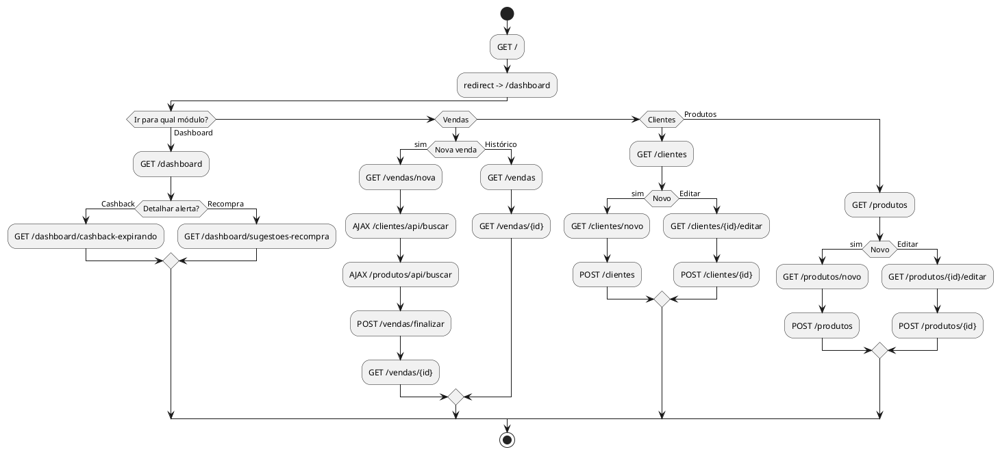

# Entregáveis de UX/UI — Bagatelle Dashboard

Este documento transforma a estrutura atual do projeto em materiais prontos para a atividade solicitada:
- **2 wireframes de baixa fidelidade**
- **5 wireframes de média fidelidade**
- **1 fluxograma com sitemap completo**

---

## 1) Mapeamento do sistema atual (base para os wireframes)

### Navegação principal (navbar)
- Dashboard
- Nova Venda
- Histórico (Vendas)
- Clientes
  - Listar Clientes
  - Novo Cliente
- Produtos
  - Listar Produtos
  - Novo Produto

### Páginas de interface (GET)
1. `/` (redireciona para `/dashboard`)
2. `/dashboard`
3. `/dashboard/cashback-expirando`
4. `/dashboard/sugestoes-recompra`
5. `/vendas`
6. `/vendas/nova`
7. `/vendas/{id}`
8. `/clientes`
9. `/clientes/novo`
10. `/clientes/{id}/editar`
11. `/produtos`
12. `/produtos/novo`
13. `/produtos/{id}/editar`

### Endpoints de apoio (AJAX/POST)
- `GET /clientes/api/buscar`
- `GET /produtos/api/buscar`
- `POST /vendas/finalizar`
- CRUD de clientes (POST criar/atualizar/deletar)
- CRUD de produtos (POST criar/atualizar/deletar)

---

## 2) Wireframes de baixa fidelidade (2)

> Objetivo: estrutura e hierarquia, sem preocupação visual fina.

## Wireframe Baixa #1 — Dashboard

```text
+--------------------------------------------------------------------------------+
| LOGO | Dashboard | Nova Venda | Histórico | Clientes v | Produtos v     Data |
+--------------------------------------------------------------------------------+
| Dashboard - Painel de Controle                                                  |
|                                                                                |
| +-----------------------------+   +-----------------------------+               |
| | Cashback Expirando          |   | Sugestões de Recompra      |               |
| | [contador]                  |   | [contador]                  |               |
| | [Ver Detalhes]              |   | [Ver Detalhes]              |               |
| +-----------------------------+   +-----------------------------+               |
|                                                                                |
| +--------------------------------------------------------------------------+   |
| | Ações Rápidas                                                            |   |
| | [Nova Venda] [Novo Cliente] [Novo Produto] [Ver Vendas]                 |   |
| +--------------------------------------------------------------------------+   |
+--------------------------------------------------------------------------------+
```

## Wireframe Baixa #2 — Nova Venda (fluxo em passos)

```text
+--------------------------------------------------------------------------------+
| NAVBAR                                                                         |
+--------------------------------------------------------------------------------+
| Nova Venda                                                                     |
|                                                                                |
| [1. Selecionar Cliente]                                                        |
| [Campo busca CPF/nome____________________] [Cadastrar Novo Cliente]            |
| [Resultados busca...]                                                          |
| [Cliente selecionado: Nome | CPF | Saldo Cashback]                            |
|                                                                                |
| [2. Adicionar Produtos]                                                        |
| [Campo busca produto/marca____________________________]                        |
| Tabela carrinho: Produto | Qtd | Preço | Subtotal | Ação                      |
| Subtotal: R$ xx,xx                                                             |
|                                                                                |
| [3. Usar Cashback (opcional)]                                                  |
| Valor cashback: [____]     Valor final: R$ xx,xx                               |
|                                                                                |
| [4. Finalizar]                                                                 |
| [Botão Finalizar Venda]                                                        |
+--------------------------------------------------------------------------------+
```

---

## 3) Wireframes de média fidelidade (5)

> Objetivo: layout mais próximo do produto final, com componentes e conteúdo realista.

## Wireframe Média #1 — Dashboard

**Estrutura:**
- Header com título e ícone
- 2 cards de notificação com CTA:
  - Cashback Expirando
  - Sugestões de Recompra
- Card de Ações Rápidas com 4 botões

**Componentes-chave:**
- Card com borda lateral colorida
- Ícone + número de destaque
- Botões primários/secundários

---

## Wireframe Média #2 — Lista de Clientes

**Estrutura:**
- Alertas de sucesso/erro no topo
- Título + botão “Novo Cliente”
- Tabela com colunas:
  - ID, Nome Completo, CPF, Telefone, Email, Saldo Cashback, Ações
- Ações por linha: editar e deletar
- Rodapé com total de clientes

**Regras de interface:**
- Estado vazio com mensagem “Nenhum cliente cadastrado”
- Saldo com badge verde

---

## Wireframe Média #3 — Formulário de Cliente (novo/editar)

**Estrutura:**
- Card centralizado
- Header contextual: “Cadastrar Cliente” ou “Atualizar Cliente”
- Campos:
  - Nome Completo
  - CPF
  - Telefone
  - Email
- Rodapé com ações:
  - Botão “Voltar”
  - Botão primário contextual (“Cadastrar”/“Atualizar”)

**Regras:**
- Máscaras/validação de CPF e telefone
- Feedback de erro por campo

---

## Wireframe Média #4 — Lista de Produtos

**Estrutura:**
- Título + botão “Novo Produto”
- Tabela com:
  - ID, Perfume, Marca, Volume, Preço, Ações
- Ações por linha: editar/deletar

**Regras:**
- Estado vazio para ausência de produtos
- Preço formatado em moeda (R$)

---

## Wireframe Média #5 — Histórico de Vendas

**Estrutura:**
- Título + CTA “Nova Venda”
- Tabela com:
  - ID, Data, Cliente, Valor Total, Cashback Usado, Valor Final, Ação
- Ação “Detalhes” por venda

**Regras:**
- Valor final destacado
- Estado vazio para “Nenhuma venda registrada”

---

## 4) Fluxograma + Sitemap completo

## 4.1 Código Mermaid (sitemap)

> Cole em Markdown compatível com Mermaid (ex.: GitHub, Notion com plugin, Mermaid Live Editor).

```mermaid
flowchart TD
    A[/**Home**/] --> B[/dashboard]

    B --> B1[/dashboard/cashback-expirando]
    B --> B2[/dashboard/sugestoes-recompra]

    B --> C[/vendas/nova]
    B --> D[/vendas]
    D --> D1[/vendas/{id}]

    B --> E[/clientes]
    E --> E1[/clientes/novo]
    E --> E2[/clientes/{id}/editar]

    B --> F[/produtos]
    F --> F1[/produtos/novo]
    F --> F2[/produtos/{id}/editar]

    C -. AJAX .-> G[/clientes/api/buscar]
    C -. AJAX .-> H[/produtos/api/buscar]
    C --> I[[POST /vendas/finalizar]]
    I --> D1
```

## 4.2 Código PlantUML (fluxo navegacional)



---

## 5) Plano rápido para você executar a tarefa acadêmica

1. **Baixa fidelidade (2 telas):** use os blocos em texto acima no papel/Figma como esqueleto.
2. **Média fidelidade (5 telas):** produza as telas listadas na seção 3 com tipografia, botões e estados.
3. **Fluxograma + sitemap:** copie o Mermaid/PlantUML da seção 4.
4. **Apresente consistência de navegação:** mesma navbar e padrões de tabela/form.
5. **Mostre estados de sistema:** vazio, sucesso, erro e confirmação de ação.

